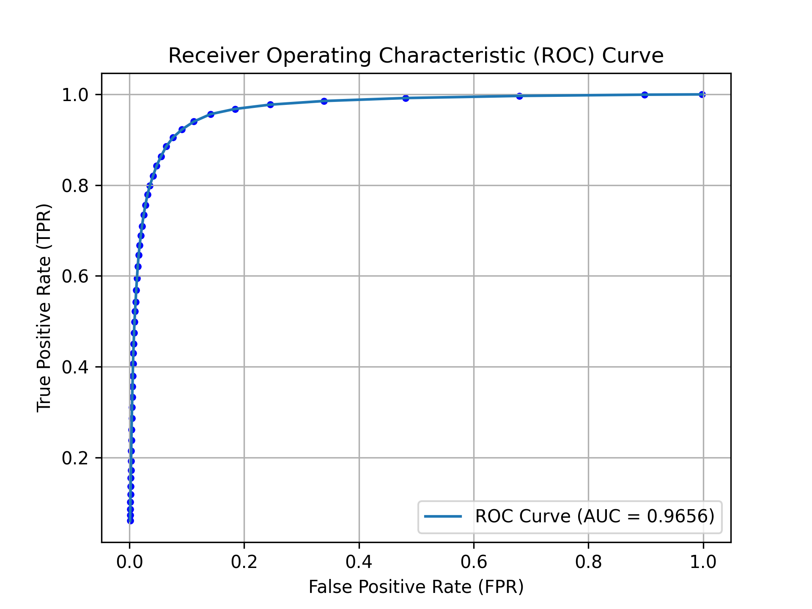
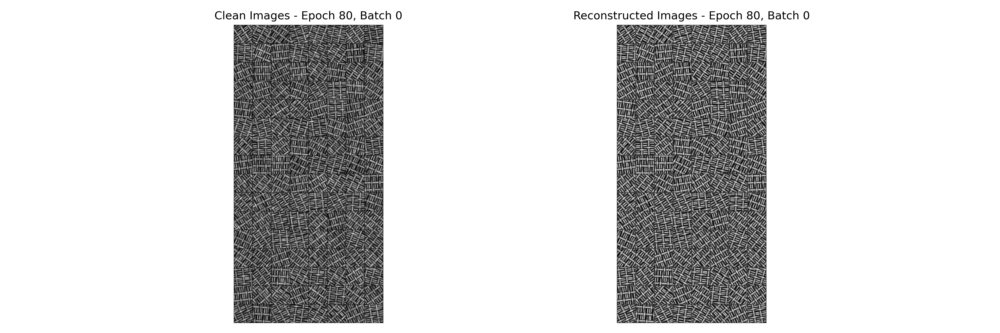
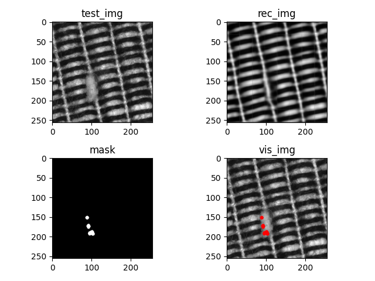

# About the Application of Autoencoders for Visual Defect Detection

Visual defect detection is a key technology in modern industrial manufacturing systems. There are many possible
appearances of product defects, including distortions in color, shape, contamination, missing or superfluous parts.
For the detection of those, besides traditional image processing techniques, convolutional neural networks based
methods have also appeared to avoid the usage of hand-crafted features and to build more efficient detection
mechanisms. In our article we deal with autoencoder convolutional networks (AEs) which do not require examples
of defects for training. Unfortunately, the manual and/or trial-and-error design of AEs is still required to achieve
good performance, since there are many unknown parameters of AEs which can greatly influence the detection
abilities.


## Datasets
MVTec Texture 1 and 2 datasets can be downloaded from the following link: 
https://www.mydrive.ch/shares/46066/8338a11f32bb1b7b215c5381abe54ebf/download/420939225-1629955758/textures.zip

Our dataset can be downloaded from here:
https://drive.google.com/file/d/1LOFXTxGGufXJWHQdBbxTfBAzhwpGmL0j/view?usp=drive_link

## Requirement
Make sure you have the following dependencies installed:

```bash
colorlog~=6.8.2
colorthief==0.2.1
kornia~=0.7.3
matplotlib~=3.8.1
numpy~=1.26.4
opencv-python~=4.9.0
pandas~=2.1.0
sklearn==1.4.0
torch~=2.2.1+cu121
torchvision~=0.17.1+cu121
tqdm~=4.66.2
scikit-image~=0.22.0
scikit-learn~=1.4.0
colorama~=0.4.6
Pillow~=10.2.0
jsonschema~=4.23.0
torchinfo~=1.8.0
```

## Installation

### Clone or Download the Repository
Begin by cloning or downloading this repository to your local machine.

### Update Configuration
Open the _data_paths.py_ file. You will find the following dictionary:

```python
root_mapping = {
    'ricsi': {
        "PROJECT_ROOT": 'C:/Users/ricsi/Documents/research/autoencoders_for_visual_defect_detection',
        "DATASET_ROOT": 'D:/storage/AE/datasets',
        "STORAGE_ROOT": 'D:/storage/AE'
    }
}
```

#### PROJECT_ROOT
- Update this path to the directory where the Python scripts and JSON files of the project are located. This directory will be used as the central repository for essential files such as weights, images, and ROC plots.
#### DATASET_ROOT: 
- Modify this path to point to the directory where your datasets are stored. This folder should contain all datasets necessary for the project.
#### STORAGE_ROOT: 
- Adjust this path to the location where you want to save project outputs and other data generated during the execution of the project.

### Create Necessary Folders
Run the __data_paths.py__ script. This will create all the required folders based on the paths specified in the configuration.

### Download Datasets
Obtain the necessary datasets and place them into the DATASET_ROOT directory as specified in your updated configuration

## Usage
### Setting Up Configuration Files
Before running the Python scripts, you need to configure your settings by preparing the following JSON and Python files:
- Training Configuration (training_config.json)
- Testing Configuration (testing_config.json)
- Augmentation Configuration (augmentation_config.json)

Once your configuration files are set up, run the Python scripts to train, test, or augment data

### Workflow
- First you must create augmented images. To do that, run the augmentation.py file.
- If you wish to use either the DAE or DAEE models, run draw_rectangles.py too.
- Run train.py. It will train the selected network on the selected dataset. By default, early stopping is activated, and the program will only save the best weights.
- Run test.py. It will evaluate the selected network on the selected dataset. Will measure ROC AUC, SSIM, MSE and save these values into a JSON file. 

## Screenshots

Below are some pictures of how the program works.

<figure align="center">
  <figcaption>ROC curve:</figcaption>
  
</figure>

<figure align="center">
  <figcaption>Training visualization:</figcaption>
  
</figure>

<figure align="center">
  <figcaption>Reconstruction visualization:</figcaption>
  
</figure>


## More info
Our paper is accessable here:
- Rádli, R., Czúni, L. (2021). About the Application of Autoencoders For Visual Defect Detection. 29. International Conference in Central Europe on Computer Graphics, Visualization and Computer Vision 2021
[](http://wscg.zcu.cz/WSCG2021/FULL/I79.pdf)


## References

Our article is mainly inspired by the following article:
- Bergmann, P., Löwe, S., Fauser, M., Sattlegger, D., & Steger, C. (2018). Improving unsupervised defect segmentation by applying structural similarity to autoencoders. arXiv preprint arXiv:1807.02011.
[](https://arxiv.org/pdf/1807.02011)

The programs are based on this repo:
https://github.com/plutoyuxie/AutoEncoder-SSIM-for-unsupervised-anomaly-detection-/tree/master

