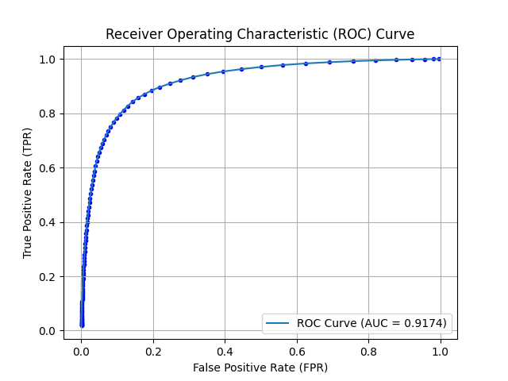
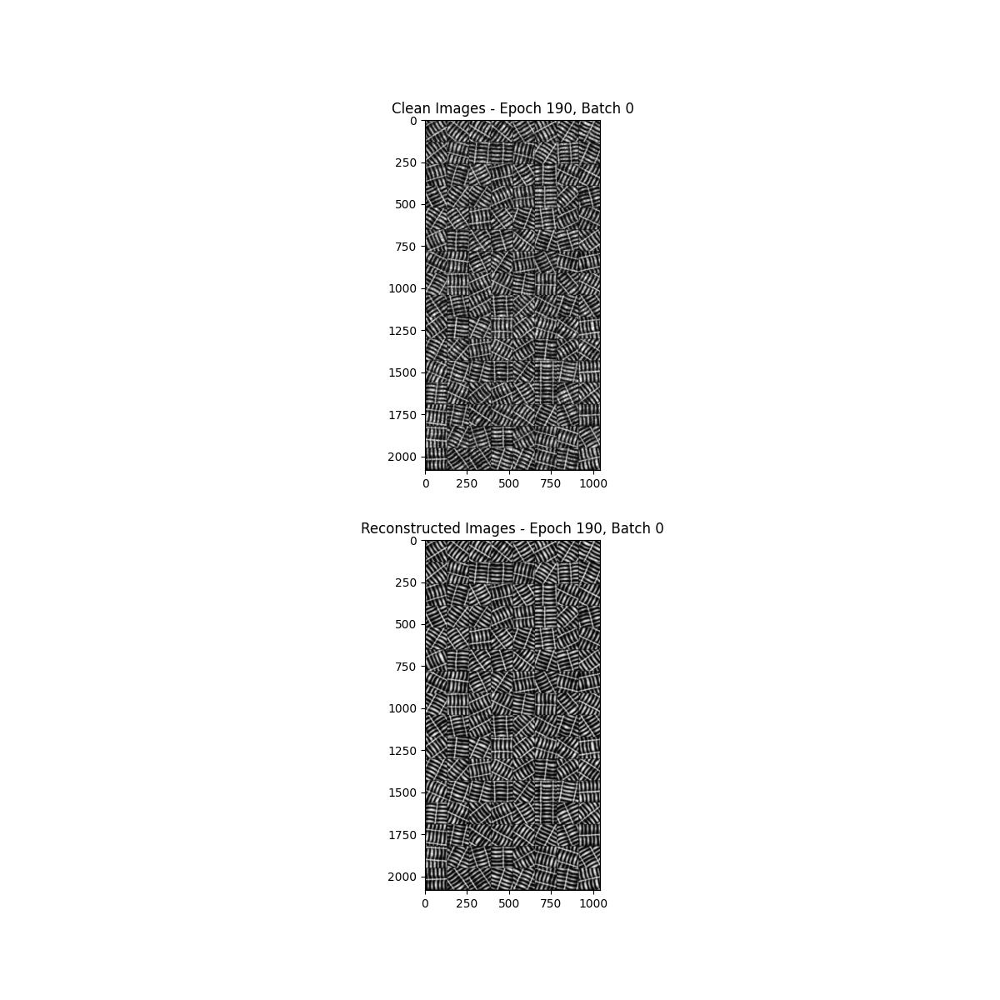
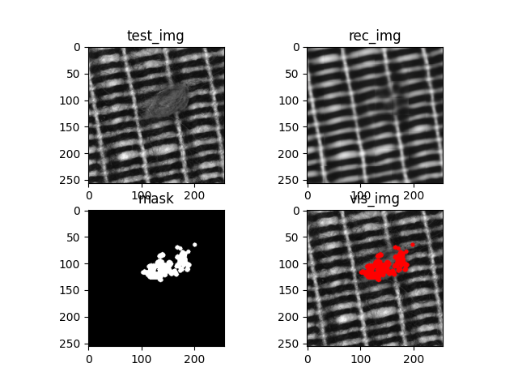

# About the Application of Autoencoders for Visual Defect Detection


Visual defect detection is a key technology in modern industrial manufacturing systems. There are many possible
appearances of product defects, including distortions in color, shape, contamination, missing or superfluous parts.
For the detection of those, besides traditional image processing techniques, convolutional neural networks based
methods have also appeared to avoid the usage of hand-crafted features and to build more efficient detection
mechanisms. In our article we deal with autoencoder convolutional networks (AEs) which do not require examples
of defects for training. Unfortunately, the manual and/or trial-and-error design of AEs is still required to achieve
good performance, since there are many unknown parameters of AEs which can greatly influence the detection
abilities.

## Datasets
MVTec Texture 1 and 2 datasets can be downloaded from the following link: 
https://www.mydrive.ch/shares/46066/8338a11f32bb1b7b215c5381abe54ebf/download/420939225-1629955758/textures.zip

Our dataset can be downloaded from here:

## Requirement
Make sure you have the following dependencies installed:

```bash
colorlog==6.7.0
colorthief==0.2.1
kornia==0.7.0
matplotlib==3.7.1
numpy==1.23.5
opencv-python==4.5.5.64
pandas==2.0.0
sklearn==0.0.post1
torch==2.0.0+cu117
torchsummary==1.5.1
torchvision==0.15.1+cu117
tqdm==4.65.0
```

## Installation
First, clone/download this repository. In the const.py file you will find this:

```python
root_mapping = {
    'ricsi': {
        "PROJECT_ROOT": 'D:/AE/storage/',
        "DATASET_ROOT": 'D:/mvtec/'
    }
}
```

- Update the designated username ('ricsi') to reflect the username associated with your logged-in operating system.
- Utilize PROJECT_ROOT as the central repository for storing essential data such as weights and images, including ROC plots, within your project.
- Employ DATASET_ROOT as the designated directory for managing datasets integral to the functioning of the project.
- const.py will create all the necessary folders.
- Download the datasets and place them into the appropropriate folders.

## Usage
In the config.py file, key parameters and settings crucial for the training, testing, and data augmentation processes are centrally stored. These configurations provide a streamlined and organized approach to manage various aspects of the project, ensuring adaptability and ease of customization.

If you wish to train the network with cropped images, the following steps must be executed:

-  In _config.py_, in the _ConfigAugmentation()_ class, set _do_augmentation_ to True, select the desired _dataset_type_, and set up the augmentation parameters.
-  Run _augmentation.py_.
-  If you wish to train the denoising autoencoder, run _draw_rectangles.py_ as well. This script will create images with rectangles.
-  Back to _const.py_, in the _ConfigTraining()_ class, set up the desired parameters. Make sure that _crop_it_ is set to True.
-  Run _train_ae.py_ or _train_dae.py_. 
-  After training, set up the parameters in _ConfigTesting()_, and run _test.py_

On the other hand, to execute the workflow without cropped images, skip _do_augmentation_ and set _crop_it_ to False.

## Screenshots

Below are some pictures of how the program works.

ROC curve:


Training visualization:


Reconstruction visualization:



## More info
Paper is accessable here:
http://wscg.zcu.cz/WSCG2021/FULL/I79.pdf
