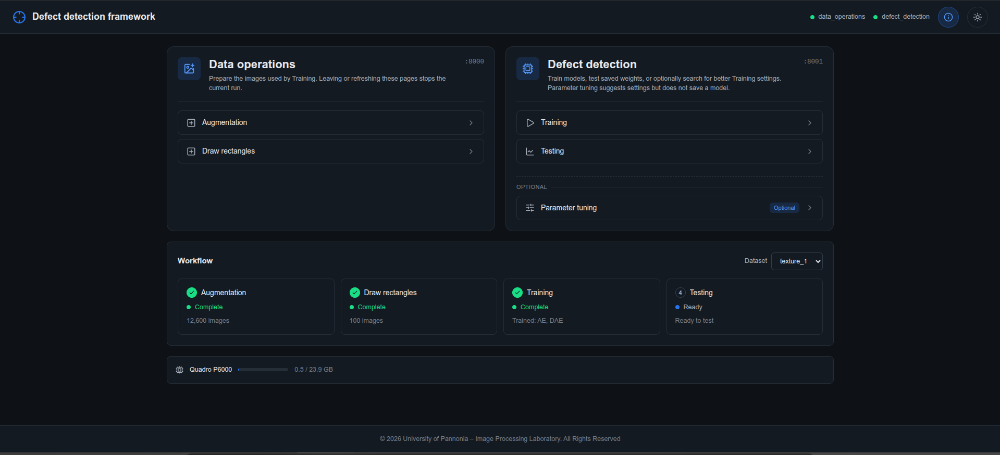
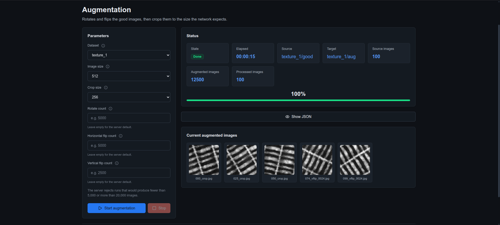
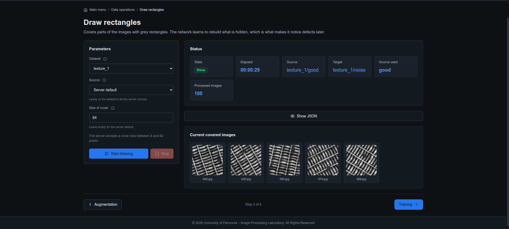
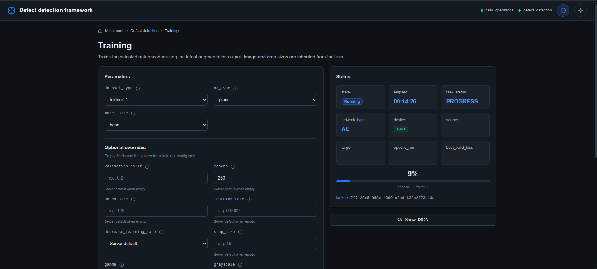
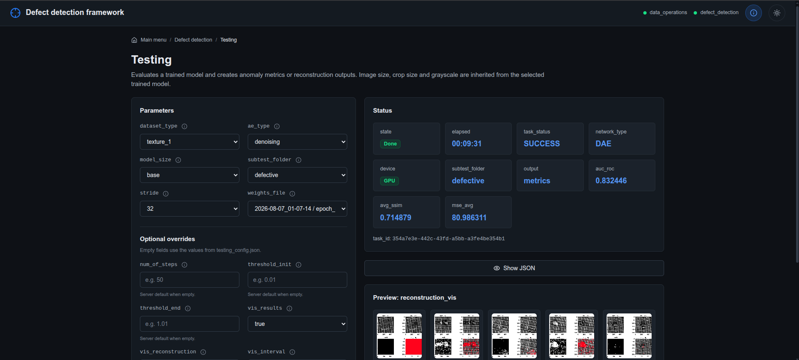
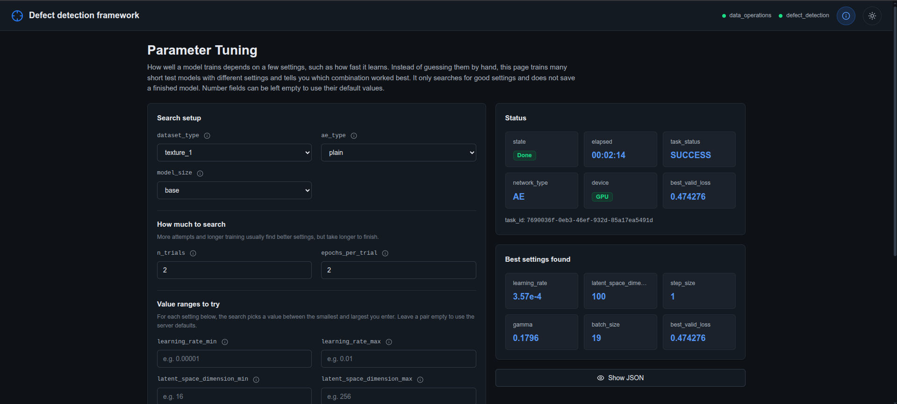
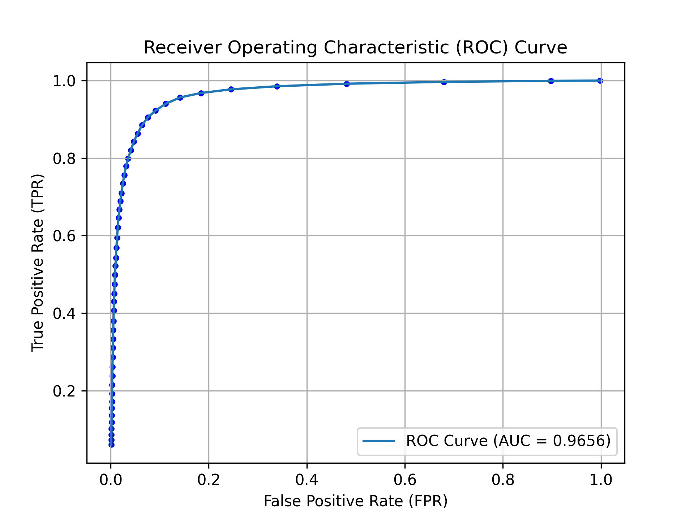
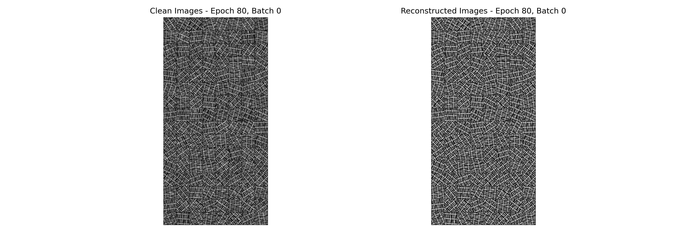
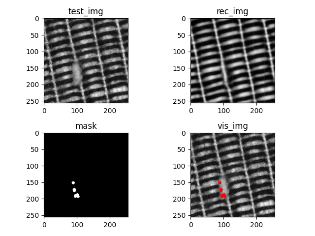

# About the Application of Autoencoders for Visual Defect Detection

Visual defects can appear as changes in color or shape, contamination, missing parts or unwanted extra parts.

This project uses convolutional autoencoders to find visual defects in images. The models are trained with images that show the expected appearance, so labelled examples of every possible defect are not required.

The application includes a web interface for preparing images, training models, testing saved weights and searching for useful training settings.

## Supported Networks

| Type | Architecture | Input | Target |
|---|---|---|---|
| `AE` | Base autoencoder | Augmented image | Same image |
| `AEE` | Extended autoencoder | Augmented image | Same image |
| `DAE` | Base denoising autoencoder | Noise image | Matching augmented image |
| `DAEE` | Extended denoising autoencoder | Noise image | Matching augmented image |

`DAE` and `DAEE` require one image in `noise` for every image in `aug`.

## Datasets

MVTec Texture 1 and Texture 2 can be downloaded here:

[Download Texture 1 and Texture 2](https://www.mydrive.ch/shares/46066/8338a11f32bb1b7b215c5381abe54ebf/download/420939225-1629955758/textures.zip)

The CPU dataset can be downloaded here:

[Download the CPU dataset](https://drive.google.com/drive/folders/1Lc9uO_i5PHz-rvlbsa7ajvMt5aiuiVhm?usp=sharing)

## Requirements

Install the following software before starting:

- Git
- Docker Engine
- Docker Compose
- NVIDIA driver
- NVIDIA Container Toolkit

A CUDA-capable NVIDIA GPU is recommended. Training and testing are much slower on CPU.

### Main versions

| Component | Version |
|---|---|
| PyTorch | 2.6.0 |
| CUDA | 12.6 |
| cuDNN | 9 |
| FastAPI | 0.137.2 |
| Celery | 5.6.3 |
| Redis | 7 |
| React | 19.2.7 |
| Vite | 8.1.1 |
| Optuna | 4.9.0 |
| TensorBoard | 2.21.0 |
| OpenCV | 4.9.0.80 |
| NumPy | 1.26.4 |

The complete dependency lists are stored in:

- `services/data_operations/requirements.txt`
- `services/defect_detection/requirements.txt`
- `frontend/package.json`

## Installation

### 1. Start Docker

Make sure Docker is running before entering the commands below.

### 2. Open a terminal

Open PowerShell, Command Prompt or a Linux terminal.

### 3. Download the repository

Copy the following commands, paste them into the terminal and press Enter:

```bash
git clone https://github.com/richardRadli/autoencoders_for_visual_defect_detection.git
cd autoencoders_for_visual_defect_detection
```

### 4. Add the datasets

Place the dataset files inside the `dataset` folder.

Texture dataset structure:

```text
dataset/
├── texture_1/
│   ├── train/
│   │   └── good/
│   └── test/
│       └── defective/
│           ├── test_images/
│           └── ground_truth/
└── texture_2/
    ├── train/
    │   └── good/
    └── test/
        └── defective/
            ├── test_images/
            └── ground_truth/
```

CPU dataset structure:

```text
dataset/
└── cpu/
    ├── train/
    │   └── good/
    └── test/
        ├── cpua/
        │   ├── test_images/
        │   └── ground_truth/
        ├── cpuc/
        │   ├── test_images/
        │   └── ground_truth/
        └── cpum/
            ├── test_images/
            └── ground_truth/
```

### 5. Build and start the application

For the first start, copy this command into the terminal and press Enter:

```bash
docker compose up --build
```

The first build downloads the Docker images and installs the dependencies.

For later starts, use:

```bash
docker compose up
```

### 6. Open the application

When the services have started, open:

[http://localhost:5173](http://localhost:5173)

API documentation:

- Data Operations: [http://localhost:8000/docs](http://localhost:8000/docs)
- Defect Detection: [http://localhost:8001/docs](http://localhost:8001/docs)

### 7. Stop the application

Press `Ctrl+C` in the terminal, then run:

```bash
docker compose down
```

## Configuration

Default values are stored in:

```text
storage/config/json_files/
├── augmentation_config/
│   └── augmentation_config.json
├── network_config/
│   └── network_config.json
├── testing_config/
│   └── testing_config.json
├── training_config/
│   └── training_config.json
└── tuning_config/
    └── tuning_config.json
```

Number fields in the frontend can be left empty to use these default values.

## Usage

Open [http://localhost:5173](http://localhost:5173) and select a service from the main menu.

<p align="center">
  
</p>

### 1. Augmentation

Augmentation creates rotated, flipped and cropped copies of the images in:

```text
dataset/<dataset_type>/train/good
```

The generated images are saved in:

```text
dataset/<dataset_type>/aug/<timestamp>
```

Training uses the latest augmentation result.

Leaving or refreshing the page stops a running augmentation.

<p align="center">
  
</p>

### 2. Draw Rectangles

This step is required only for `DAE` and `DAEE`.

Draw Rectangles covers parts of the augmented images with gray rectangles. The results are saved in:

```text
dataset/<dataset_type>/noise/<timestamp>
```

The number of images in `aug` and `noise` must match.

Leaving or refreshing the page stops a running operation.

<p align="center">
  
</p>

### 3. Training

Training uses the latest images from `aug`.

- `AE` and `AEE` use the augmented images.
- `DAE` and `DAEE` use matching images from `noise` and `aug`.
- The best weights are saved automatically.
- Early stopping can finish the run before the selected epoch count.
- Progress, elapsed time and the current device are shown in the Status panel.

Saved weights are stored in:

```text
storage/data/<dataset_type>/model_weights/<network_type>/<timestamp>
```

TensorBoard logs are stored in:

```text
storage/data/<dataset_type>/model_logs/<network_type>/<timestamp>
```

<p align="center">
  
</p>

### 4. Testing

Testing uses previously saved model weights.

The user can select:

- the dataset;
- the network type;
- the test folder;
- the saved weight file.

Testing compares each input image with the image created by the trained model. Large differences can indicate a possible defect.

The run saves:

- ROC AUC, SSIM and MSE values;
- ROC plots;
- result images;
- reconstruction images.

<p align="center">
  
</p>

### Parameter Tuning

Parameter Tuning is optional and is available under Defect Detection.

Optuna tests values for:

- learning rate;
- latent space dimension;
- step size;
- gamma;
- batch size.

The result shows the best values and the best validation loss.

Parameter Tuning does not save weights or a finished model. The returned values can be entered on the Training page.

<p align="center">
  
</p>

## TensorBoard

Normal Training saves TensorBoard logs. Parameter Tuning does not.

To start TensorBoard with Docker, open another terminal in the repository folder and run:

```bash
docker compose run --rm -p 6006:6006 defect_detection tensorboard --logdir /app/storage/data --host 0.0.0.0 --port 6006
```

Then open:

[http://localhost:6006](http://localhost:6006)

If TensorBoard is installed in a local Python environment, it can also be started with:

```bash
tensorboard --logdir storage/data --port 6006
```

## Model Output Examples

### ROC curve

<p align="center">
  
</p>

### Training visualization

<p align="center">
  
</p>

### Reconstruction visualization

<p align="center">
  
</p>

## More Information

The related paper is available here:

Rádli, R., Czúni, L. (2021). *About the Application of Autoencoders for Visual Defect Detection*. 29th International Conference in Central Europe on Computer Graphics, Visualization and Computer Vision.

[](http://wscg.zcu.cz/WSCG2021/FULL/I79.pdf)

## References

The project is mainly inspired by:

Bergmann, P., Löwe, S., Fauser, M., Sattlegger, D., and Steger, C. (2018). *Improving unsupervised defect segmentation by applying structural similarity to autoencoders*. arXiv:1807.02011.

[](https://arxiv.org/pdf/1807.02011)

The original implementation was based on:

[AutoEncoder-SSIM for Unsupervised Anomaly Detection](https://github.com/plutoyuxie/AutoEncoder-SSIM-for-unsupervised-anomaly-detection-)